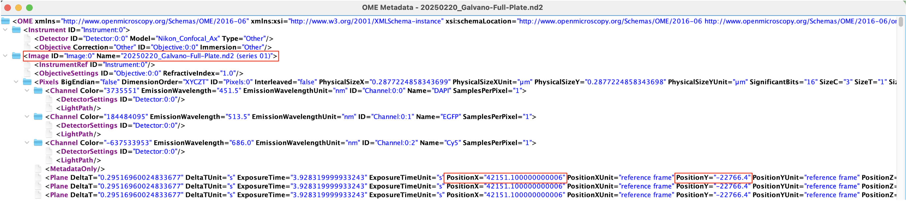

# Crafting-Software-Final-Project

## Renaming Microscope Images Based on Position Data

This program processes ND2 files, parses XML metadata, compares positions, and renames TIFF files based on a provided CSV mapping. The tool is useful for organizing microscopy images and their corresponding points from a multipoint experiment.

### Proposal

In our lab, we image cells in well plates. Using our Nikon microscope software (NIS-Elements), we can navigate to individual wells, store the x/y coordinates and name the position for later image acquisition. I like to store and name all the positions that I want to image, then have the program automatically navigate to each, capture the image, then move onto the next stored point. 
 

An ND2 file will be created of the raw data recorded. This file will include all the images captured at all the positions (ie. Wells B2, B4, B6), along with metadata. I can then open this ND2 file in FIJI (an image processing program), where I can do analysis, and export my edited images as TIFF files. 

My issue has been that the names I provide for the captured positions are not carried over to the ND2 file. I can separately save an XML file of the stored positions, which has the name of the position, as well as the position coordinates.
 
 

The ND2 file OME Metadata, which I can open in FIJI, also has the position data. 
 
 

This program compares these two files, matching the position data, and renames TIFF files (processed in FIJI) based on their strName in the XML file. 

